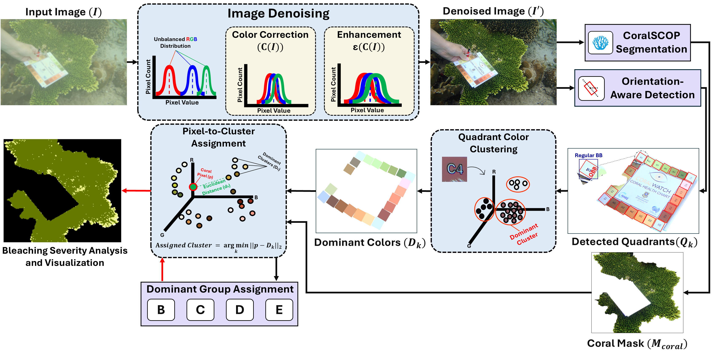
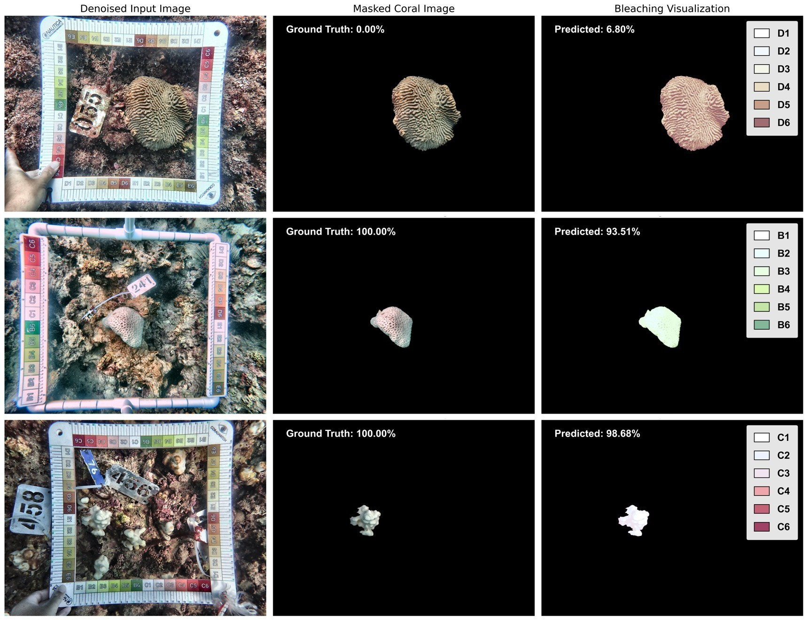

<h1 align="center">
  <br>
  Coral-CRCA: A Color-Reference Chart Automation Algorithm for Coral Bleaching Visualization and Severity Assessment
</h1>

<h2 align="center">
Authors:</h2>

<div align="center">
  <a href="https://scholar.google.com/citations?user=KyBKIm8AAAAJ&hl=en">Mahmoud Elmezain</a> &nbsp;•&nbsp;
  <a href="https://scholar.google.com/citations?user=2_e4vboAAAAJ&hl=en">Atif Sultan</a> &nbsp;•&nbsp;
  <a href="https://scholar.google.com/citations?user=fZkn9poAAAAJ&hl=en">Mobeen Ur Rehman</a> &nbsp;•&nbsp;
  <br/>
  <a href="https://ieeexplore.ieee.org/author/820923684760909">Sultan Alshehhi</a> &nbsp;•&nbsp;
  <a href="https://scholar.google.com/citations?user=JsUhbe0AAAAJ&hl=en">Maryam R. Al Shehhi</a> &nbsp;•&nbsp;
  <a href="https://scholar.google.com/citations?user=bCC3kdUAAAAJ&hl=en">Irfan Hussain</a> &nbsp;•&nbsp;
  <br/>
</div>

<h4 align="center">
  <a href="https://www.sciencedirect.com/science/article/pii/S0025326X26001712?dgcid=rss_sd_all"><b>Paper</b></a> &nbsp;•&nbsp; 
</h4>

<div align="center">

[](https://opensource.org/licenses/MIT) &nbsp;&nbsp;&nbsp;&nbsp;   &nbsp;&nbsp; 

</div>

[cc-by-sa]: http://creativecommons.org/licenses/by-sa/4.0/
[cc-by-sa-shield]: https://img.shields.io/badge/License-CC%20BY--SA%204.0-lightgrey.svg

---

# About this project 🪸

Coral reefs are among the most diverse and productive marine ecosystems, providing food security and livelihoods for millions of people, especially in coastal and rural areas where small-scale reef fisheries are a main source of fish. Rising sea temperatures and pollution are causing widespread bleaching, driven by the loss of algal symbionts, and accelerating reef degradation. Underwater imaging paired with color-based health charts provides a non-invasive method for monitoring bleaching. However, current approaches require extensive manual annotation and are limited by underwater image noise such as blur and color casts. Existing AI-based monitoring approaches are often semi-autonomous and lack fine-grained bleaching localization capabilities.

We propose **Coral Color-Reference Chart Automation (Coral-CRCA)**, a multi-stage algorithm that replicates the visual assessment process used by marine biologists to fully automate coral bleaching evaluation with color-reference charts. Initially, the pipeline incorporates a preprocessing image denoising module to improve robustness to underwater image distortions. The method then segments the coral region, isolates chart quadrants, and assigns each coral pixel to the closest reference grade by color similarity, generating pixel-level bleaching visualizations and reporting bleaching percentage. 

---

## Features

- **Visualization & Localization of Coral Bleaching**  
  Generates pixel-level bleaching maps for interpretable, spatially precise analysis.

- **Fully Autonomous Assessment**  
  Performs end-to-end bleaching evaluation directly from raw underwater images.

- **Adaptability to Underwater Conditions**  
  Applies image denoising and color correction to handle blur and color distortion without ex-situ analysis.

- **Bleaching Percentage Reporting**  
  Reports bleaching severity as a percentage, providing ecologically meaningful metrics beyond classification.

---

## Pipeline

The input image is first processed using underwater image denoising techniques to correct color casts and reduce blur. The denoised image is then passed through:

1. **Coral segmentation (CoralSCOP / SAM)** to extract coral regions.  
2. **YOLOv11-OBB chart detection** to localize the color reference chart and its quadrants.  
3. **Dominant color extraction** for each chart quadrant (B1–6, C1–6, D1–6, E1–6).  
4. **Pixel-wise color matching** that assigns each coral pixel to its closest reference grade, enabling:
   - Spatial visualization of bleaching patterns.
   - Bleaching percentage estimation (bleached vs healthy grades).

<p align="center">
  
</p>

<p align="center">
  
</p>

---

# Running the Codes 🚀

> **Hardware & environment note.** All experiments were conducted on a workstation equipped with an **AMD Ryzen 9 7950X 16-core CPU**, **128 GB RAM**, and an **NVIDIA RTX A6000 GPU (48 GB)**. The Conda version used is **24.11.3**.  
> ⚠️ **GPU is strongly recommended** for the SAM / CoralSCOP segmentation step.

---

## Installation

### 1. Clone the repository

```
git clone https://github.com/MahmoudElMezain/Coral-CRCA_Color-Reference-Chart-Automation-Algorithm.git
cd Coral-CRCA_Color-Reference-Chart-Automation-Algorithm 
```

### 2. Create and activate the Conda environment

The repository includes an environment.yml file that captures all required Python packages (PyTorch + CUDA, Ultralytics YOLO, Segment Anything, OpenCV, colour-science, scikit-learn, etc.).

```
conda env create -f environment.yml
conda activate coral-crca 
```

### 3. Download pretrained model weights

Model weights are not stored in this repository. Please download them manually.
- Install [CoralSCOP Weights](https://drive.google.com/drive/folders/1tI4BtZ7YrwPtx_4GUrDOEzdl9UiAUPtt) and place them in ```checkpoints/``` folder. The path is referenced in the main script as: ```sam_checkpoint = os.path.join("checkpoints", "vit_b_coralscop.pth")```
- Install [YOLO Weights](https://drive.google.com/drive/folders/1sDwTxm7h_ZHsB5KP1fV-xyve8mjMCELA) and place them in: ```Weights/``` folder
---
>⚠️**Important** The YOLOv11-OBB models were trained on our own photoquadrat images under specific survey conditions. They may not generalize perfectly to very different imaging setups. We recommend trying all five variants (N, S, M, L, X) and adjusting the confidence threshold to see which one works best for your data.
---

### 4- Quick run
```
conda activate Coral-CRCA   # or your chosen env name
cd Coral-CRCA_Color-Reference-Chart-Automation-Algorithm
python Full_Pipeline.py
```

You should see:

- **Preprocessing:** original vs denoised/enhanced image.
- **YOLO detections:** chart quadrants with rotated bounding boxes overlaid.
- **SAM segmentation:** indexed candidate coral masks; select the best index in the terminal.
- **Bleaching output:** printed bleaching percentage and a visualization.

# Project Structure 🏗️
```
Coral-CRCA_Color-Reference-Chart-Automation-Algorithm/
├── README.md
├── environment.yml
│
├── Full_Pipeline.py                    # Main end-to-end Coral-CRCA pipeline
├── Color_Correction_Module.py          # Underwater color correction & dehazing
├── Image_Enhancement_Module.py         # Contrast / gamma / Rayleigh enhancement
├── Watch_Quadrant_Separator_Module.py  # YOLOv11-OBB CoralWatch chart detector
├── Dominant_Color_Module.py            # Dominant color extraction per chart quadrant
├── Coral_Segmentation_Module.py        # CoralSCOP (SAM) coral mask generator
├── Bleaching_Percentage_ModuleV3.py    # Color matching & bleaching percentage
│
├── Denoising_UTILS/                    # DCP and UDCP-based underwater dehazing utilities
│   └── UDCP/
│       └── ...                         # GuidedFilter, dark channel, radiance, etc.
│   └── DCP/
│
├── segment_anything/                   # Local copy of Segment Anything (SAM)
│   └── ...
│
├── Test_Images/                        # Example test images with CoralWatch chart
│   ├── CM01-CT004 CO S074.JPG
│   ├── CM01-CT004 FR R091.JPG
│   └── CM02-CT004 RCO B-30.JPG
│
├── checkpoints/                        # CoralSCOP checkpoints (download separately)
│   └── vit_b_coralscop.pth
│
├── Weights/                            # YOLOv11-OBB weights (download separately)
│   ├── YOLOv11N.pt
│   ├── YOLOv11S.pt
│   ├── YOLOv11M.pt
│   ├── YOLOv11L.pt
│   └── YOLOv11X.pt
│
└── Media/                              # Figures for README (pipeline, results, logos)
```


## Bibtex
```
@article{ELMEZAIN2026119384,
      title={Coral-CRCA: A Color-Reference Chart Automation Algorithm for Coral Bleaching Visualization and Severity Assessment},
      author={Mahmoud Elmezain and Atif Sultan and Mobeen Ur Rehman and Sultan Alshehhi and Maryam R. Al Shehhi and Irfan Hussain},
      journal={Marine Pollution Bulletin},
      volume = {226},
      pages = {119384},
      year={2026}
    }
```

